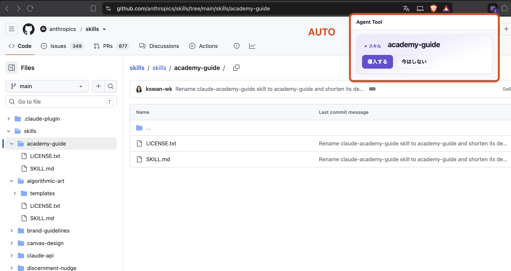
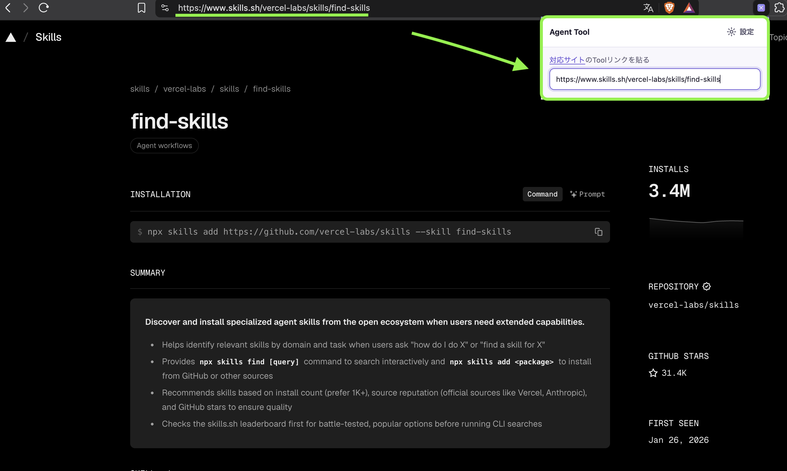

<p align="center">
  
</p>

**Find Skills, Install Easily!**

# Agent Tool

[](https://github.com/den0206/agent-tool/actions/workflows/ci.yml)
[](https://github.com/den0206/agent-tool/releases)
[](https://open-vsx.org/extension/yuuki-sakai/agent-tool)
[](LICENSE)

Agent Tool has two parts that share the same detection and install logic: a **[Cursor/VS Code extension](#ide-extension)** for managing Skills, Subagents, MCP servers, and Plugins across AI coding agents, and a **[browser extension](#browser-extension)** for Chrome, Edge, and Brave that catches Skills and Subagents while you browse and installs them without leaving the page.

### IDE extension (Cursor)

<p align="center">
  
</p>

### Browser extension (Chrome/Edge — coming soon)

#### Automatic detection

<p align="center">
  
</p>

#### URL input detection

<p align="center">
  
</p>

## Overview

Agent Tool keeps the resources used by your coding agents discoverable from one place. The IDE extension scans the agents' supported locations and delegates agent-owned operations to their official CLI; the browser extension writes only into folders you explicitly pick.

## Features

- See Skills, Subagents, MCP servers, and Plugins in one dashboard.
- Install Skills and Subagents from GitHub and supported catalogs.
- Install Claude Code and Codex Plugins, including Plugins in GitHub subdirectories.
- Preview descriptions, locations, scopes, enabled state, and available updates.
- Work across user and project resources without copying managed files.
- Install Skills and Subagents straight from the browser with the companion Chrome/Edge/Brave extension — no IDE extension required.
- Run on macOS, Linux, and Windows.

## Supported sources

Paste a URL from any of these into the extension's URL field.

| Site                                             | Example URL                                           | How the source is resolved                                                                      |
| ------------------------------------------------ | ----------------------------------------------------- | ----------------------------------------------------------------------------------------------- |
| [GitHub](https://github.com/)                    | `https://github.com/owner/repo/tree/main/skills/pdf`  | From the URL.                                                                                   |
| [skills.sh](https://skills.sh/)                  | `https://skills.sh/anthropics/skills/frontend-design` | From the URL — `owner/repo` is part of the path.                                                |
| [Agents Directory](https://agentsdirectory.dev/) | `https://agentsdirectory.dev/skills/frontend-design/` | The page is read once, and only its schema.org JSON-LD metadata is used to find the repository. |

Sites are declared in `CATALOG_SITES` in `core/github.ts`, which both extensions read, so a new site reaches both at once. The browser extension also needs the host in its manifest. The page HTML is never scraped — a site whose URL does not carry `owner/repo` must publish a JSON-LD `codeRepository` or `url`.

## IDE extension

The Cursor/VS Code extension. It scans the agents' supported locations and shows everything in one Tree View; installing, removing, enabling, and updating is delegated to the agent's own CLI wherever one exists.

### Requirements

- Cursor or VS Code with extension support, for Node.js 20 or later.
- The agent CLI you want to inspect or manage, such as Claude Code or Codex.
- Internet access when fetching a remote source or registering a Plugin Marketplace.

### Installation

Download the `.vsix` file from the [GitHub Releases](https://github.com/den0206/agent-tool/releases) page, then install it with:

```bash
code --install-extension agent-tool-X.Y.Z.vsix
# or use: cursor --install-extension agent-tool-X.Y.Z.vsix
```

You can also use **Install from VSIX…** in the Extensions view. Stable releases are published to [Open VSX](https://open-vsx.org/extension/yuuki-sakai/agent-tool) as well.

### Usage

1. Open Cursor or VS Code and activate Agent Tool from the Activity Bar.
2. Review the User Global and project sections in the dashboard.
3. Use the add action to paste a supported GitHub or catalog URL (see [Supported sources](#supported-sources) above).
4. Select a detected Skill, Subagent, MCP server, or Plugin and confirm the operation.
5. Use the refresh and update actions when you want to rescan sources or check remote revisions.

Plugin installation is delegated to Claude Code or Codex. For Claude Code, a Marketplace is registered before the Plugin is installed.

<p align="center">
  
</p>

## Browser extension

A companion extension for Chrome, Edge, and Brave that spots Skills and Subagents while you browse the [supported sources](#supported-sources) above and installs them without leaving the page. It works on its own — the IDE extension above is not required, though installs are picked up by it on the next scan if you also have it.

### Requirements

- Chrome, Edge, or Brave. (Brave turns the File System Access API off by default; the extension detects this and links to the `brave://flags` steps to turn it on.)
- The same folders the IDE extension uses — you pick one the first time you install something.

### Installation

Not yet on the Chrome Web Store — see the [release plan](docs/agent-tool-release-plan.md) for the submission checklist. Until then, build and load it unpacked:

```bash
npm run package:browser
```

This produces `vsix/browser/`. Open `chrome://extensions` (or the Brave/Edge equivalent), turn on **Developer mode**, and choose **Load unpacked**, pointing at `vsix/browser/`. The same command also writes `vsix/agent-tool-browser.zip`, the file a `release/Ver_<semver>` release attaches alongside the VSIX and the one submitted to the stores.

### Usage

1. Browse to a supported page (a Skill or Subagent on GitHub, skills.sh, or Agents Directory). If detection finds one, the popup opens on its own:

   <p align="center">
     
   </p>

   Turn this off in **Settings** if you'd rather open the popup yourself.

2. Or open the extension icon and paste a supported URL directly — no need to visit the page first:

   <p align="center">
     
   </p>

3. Choose the target agent from the dropdown and select **Install**. The first time, your browser's folder picker asks you to choose the agent's config directory (`~/.claude`, `~/.cursor`, `~/.codex`, or the shared `~/.agents`); it is remembered after that.
4. Open **Settings** to see everything the extension has installed, remove an item, re-grant a folder, or switch the popup's theme (System / Light / Dark).

### Privacy

- It writes only into folders you pick yourself, through the File System Access API. It never requests `<all_urls>`.
- Pages you visit are never stored. Only the directory handles, the list of what it installed, and the auto-open and theme settings are kept — all locally, in the browser's own IndexedDB.
- It records where each tool came from next to the files it wrote. If you also use the IDE extension, it picks those up on its next scan, so the tool can be removed, disabled, and updated from the dashboard like anything else.
- See [`PRIVACY.md`](PRIVACY.md) for the full policy.

## Development

Requirements: Node.js 20.

```bash
npm ci
npm run check          # typecheck + tests + invariant checks
npm run package         # IDE extension → vsix/agent-tool.vsix
npm run package:browser # browser extension → vsix/agent-tool-browser.zip
```

The extensions use only in-memory caches. The IDE extension's only mutable metadata file is `registry.json` under Cursor's `globalStorageUri`; temporary downloads and extraction directories are removed on every exit path. The browser extension's only persistence is IndexedDB (directory handles, the installed-items list, and two settings) — see [Privacy](#privacy) above.

Press F5 in Cursor or VS Code to launch an Extension Development Host for the IDE extension.

## Release

**IDE extension:** create and push a branch named `release/Ver_X.Y.Z`. GitHub Actions runs the checks, creates one VSIX, records its SHA-256 checksum, and attaches it to the GitHub Release. Stable releases are also published to Open VSX when the `OVSX_PAT` secret is configured.

**Both extensions:** push `release/Ver_<semver>`. GitHub Actions gives `package.json` and `browser/manifest.json` that version, runs the checks, packages the VSIX and browser zip, records their SHA-256 checksums, and attaches all four files to one GitHub Release. The VSIX is also published to Open VSX for stable versions when `OVSX_PAT` is configured. Chrome Web Store submission runs only when its required Secrets are all configured; after Chrome approves, submit the same zip to Edge Add-ons manually. See [`docs/browser-store-listing.md`](docs/browser-store-listing.md) and the [release plan](docs/agent-tool-release-plan.md#ブラウザ拡張の配布).

## Documentation

- [Product requirements](docs/product-requirements.md)
- [Design decisions](docs/vscode-cursor-extension-design-questions.md)
- [Module API](docs/agent-tool-cli-api.md)
- [Storage and locking](docs/agent-tool-data-spec.md)
- [Security](docs/agent-tool-security.md)
- [Test plan](docs/agent-tool-test-plan.md)
- [Release plan and progress](docs/agent-tool-release-plan.md)
- [Browser extension store listing](docs/browser-store-listing.md)
- [Privacy policy](PRIVACY.md)

## License

[MIT](LICENSE)

[日本語](README.ja.md)
